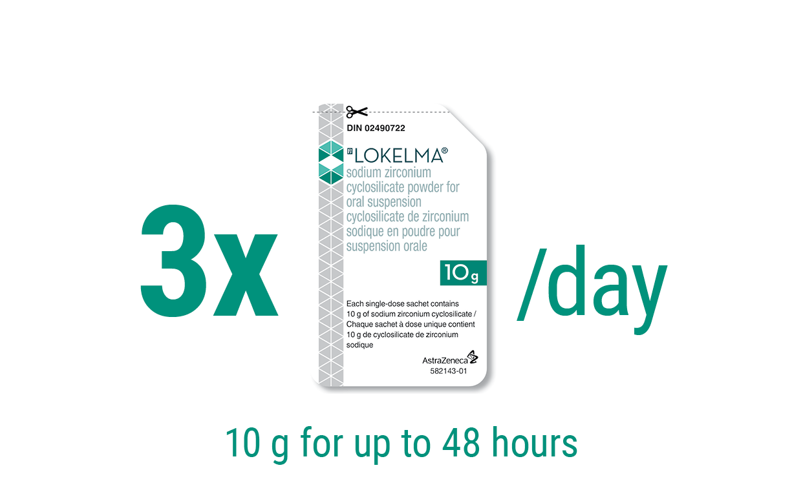
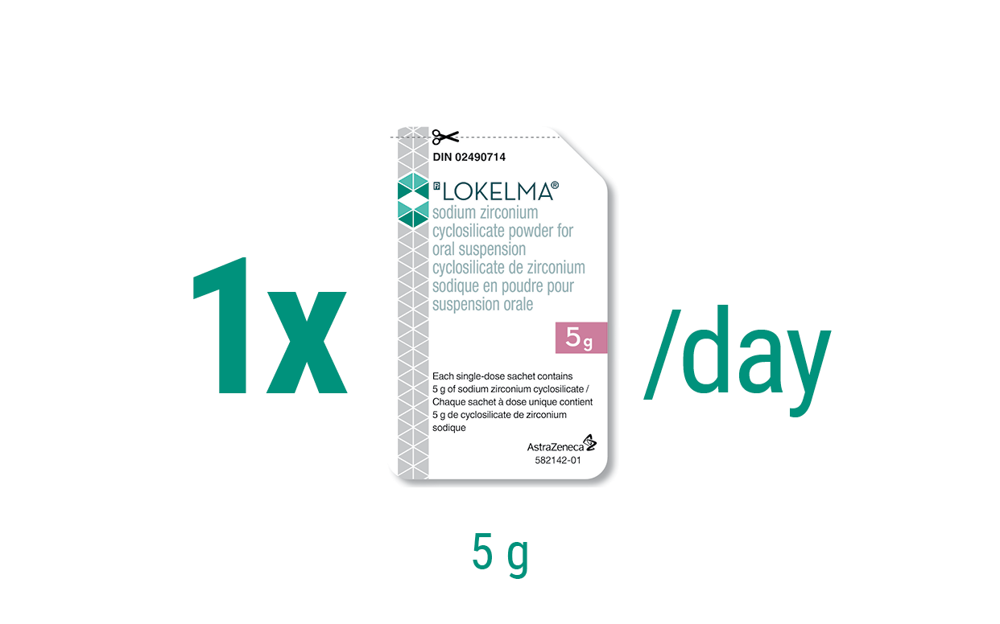
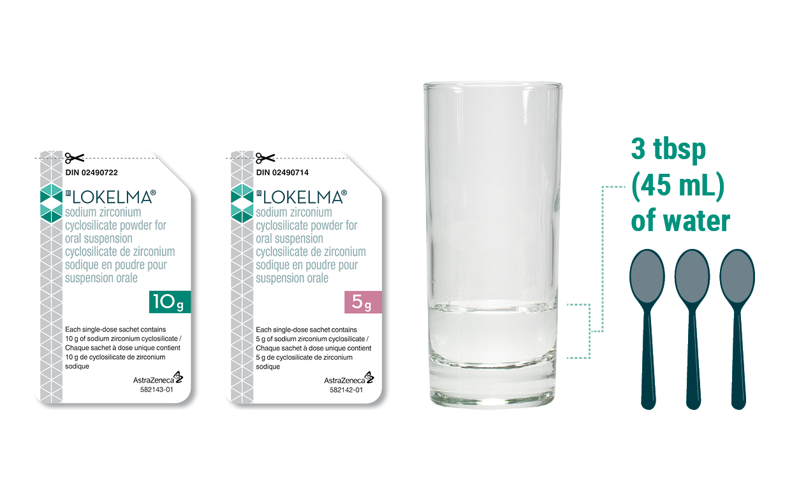

# Dosing & Administration

## Hero Banner

| Hero Banner |
|---|
|  |
| Dosing & Administration |

## Dosing Section 1

### Correction Phase Dosing1\*

Recommended dosing in the correction phase

| Columns Dosing (green) |  |
|---|---|
|  | Correction Phase \| TID dosing |
| 
3x/day
10 g for up to 48 hours

 | <ul><li>Once normokalemia is achieved, follow maintenance phase regimen</li><li>If normokalemia is not achieved at the start of day 3, other treatment approaches should be considered</li></ul> |

## Dosing Section 2

### Maintenance Phase Dosing1\*

Recommended dosing in the maintenance phase

| Columns Dosing (pink) |  |
|---|---|
|  | Maintenance Phase \| Once-daily dosing |
| 
1x/day
5 g

 | <ul><li>Use minimal effective dose to prevent recurrence of hyperkalemia†</li><li>Titrate in 5 g increments (as required), up ▲ to 10 g once a day or down ▼ to 5 g once every other day</li></ul> |

## Dosing Section 3

### Chronic Hemodialysis Dosing1\*

Recommended dosing for chronic hemodialysis patients

| Columns Dosing (pink) |  |
|---|---|
|  | Once-daily dosing only on non-dialysis days |
| 
1x/day
5 g

 | <ul><li>No correction phase is necessary</li><li>Titrate up ▲ or down ▼ weekly to establish normokalemia</li><li>Based on pre-dialysis K+ value after the long inter-dialytic interval (LIDI)</li><li>Adjust dose in increments of 5 g up ▲ to 15 g or down ▼ to 0 for a few days</li><li>Monitor pre-dialysis post-LIDI serum K+ regularly (every 4 or more weeks) to maintain normokalemia</li><li>In patients with serum potassium levels <3.0 mmol/L, LOKELMA should be discontinued and the patient should be re-evaluated</li></ul> |

## Administration Section

### Administration1\*

LOKELMA reconstitution and administration

*LOKELMA is an odourless powder, which is tasteless when mixed with water2*

| Columns Dosing |  |
|---|---|
|  |  |
| 

3 tbsp 45 mL of water

 | <ul><li>LOKELMA is white-to-grey, insoluble powder for oral use, and can be taken with or without food1</li><li>Administer LOKELMA orally as a suspension in water1</li><li>Empty the entire contents of the sachet(s) into a drinking glass containing approximately 3 tbsp (45 mL) of water1</li><li>Stir well, and drink while the powder – which does not dissolve – is still suspended1</li><li>If the powder settles, the water should be stirred again1</li><li>Use additional water to ensure the entire dose is taken1</li><li>LOKELMA should be taken immediately after reconstitution1</li></ul> |

## Footnotes and References

### Section Footnotes

\* Please see Product Monograph for complete dosing and administration information.

† Monitor serum K+ as standard practice and adjust dose based on serum K+ level and desired target range.1

**References:**

1. LOKELMA® Product Monograph. AstraZeneca Canada Inc. December 7, 2023.
2. AstraZeneca. Data on File. CMC Dossier: 2.5 Clinical Overview, May 7, 2018.
