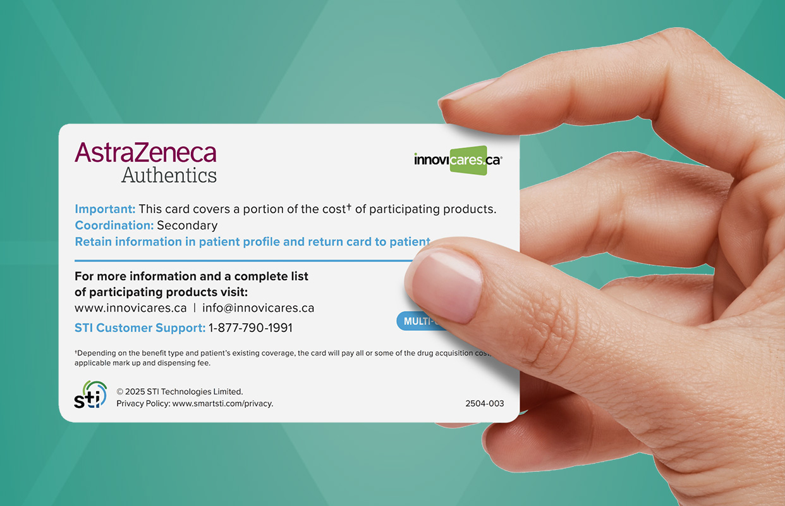
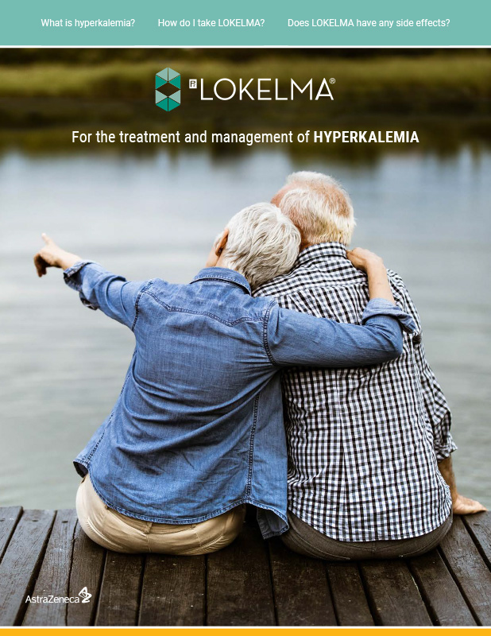
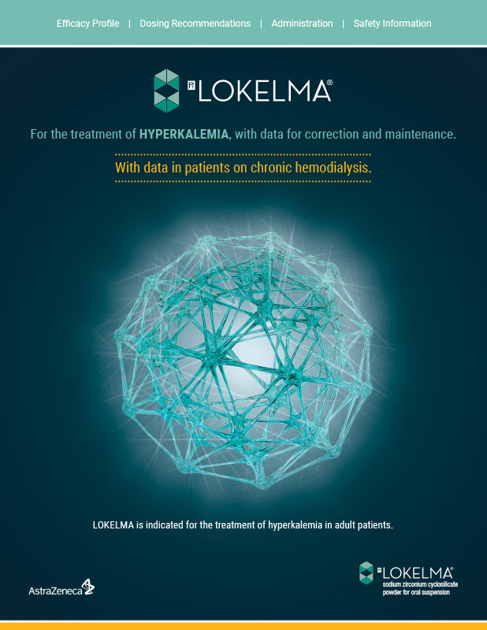
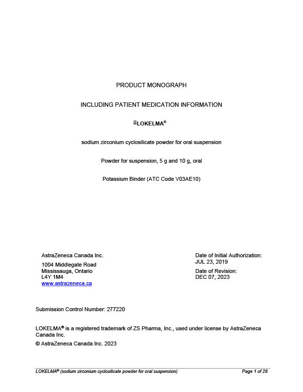
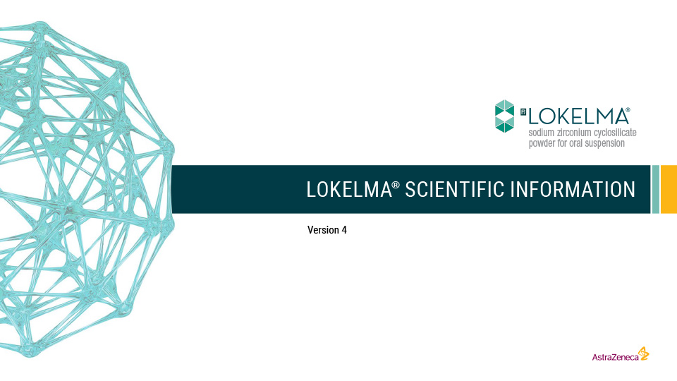

# Resources

## Hero Banner

| Hero Banner |
|---|
|  |
| Resources |

## Page Title

### Explore LOKELMA resources for patients and HCPs

## Payment Assistance Card

### Payment Assistance Card

The AstraZeneca Authentics Program provides financial assistance designed to help LOKELMA patients save on their prescription costs. AstraZeneca Authentics provides a free Prescription Savings Card that will cover a portion of the price and can be used in conjunction with their private or public health plans.

### 2 easy steps to help patients save on LOKELMA: (columns-resources)

| Columns Resources |
|---|
| **2 easy steps to help patients save on LOKELMA:**  1. Patient can download their free [Prescription Savings Card](https://AZAuthentics.ca) 2. Ask your patient to present their Prescription Savings card with their LOKELMA prescription at their pharmacy  [Patient Website](#) |
|  |

## Patient Tear Sheet (columns-resources)

| Columns Resources |
|---|
|  |
| **Patient Tear Sheet**  An easy-to-understand resource to help patients learn about hyperkalemia, LOKELMA treatment, how to take it, and what to expect during therapy.  [Download](#) |

## Dose Card (columns-resources)

| Columns Resources |
|---|
| **Dose Card**  A quick-reference guide containing dosing information, clinical data for LOKELMA in correction and maintenance phases and data for patients on chronic hemodialysis.  [Download](#) |
|  |

## Product Monograph (columns-resources)

| Columns Resources |
|---|
|  |
| **Product Monograph**  Browse the Product Monograph to learn about LOKELMA efficacy, safety and dosing information.  [Download](#) |

## LOKELMA Data Resource (columns-resources)

| Columns Resources |
|---|
| **LOKELMA Data Resource**  Take a deeper dive into the LOKELMA clinical trial program, efficacy data and safety and tolerability profiles.  [Download](#) |
|  |
